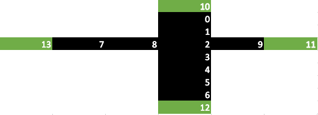

# A (very) simple OpenAI gym masked action environment

This repo has a very simplistic implementation of an environment with masked actions, where the actions represent potential future states.

## Environment rendering

The image below shows how the environment looks like. It is a simple version of the Maze environment, the difference being instead of having probable actions *up,down,right,left*, in this case actions can be any state in the environment that is accessible from the current state. Therefore, a mask is used in the ```env.observation_space ``` which gives 1 for all states accessible from the current state (unless one of the new states has already been visited), and zero otherwise.

Below is an image of the environment. On ```env.reset()```, the agent appears on one of the non-terminal states **(0-9)** and the objective is to reach one of the terminal states **(10-13)** with the minimum number of steps.



## Environment parameters

 - Every state has a unique, optimal path to termination

 - Reward:
   * -1 for every move towards non-terminal state
   * +100 for reaching a terminal state (exiting the maze)
   * The agent can't go back to its parent node

## Example

Assuming the agent starts at state 3, the following table shows the first two steps. Note that the mask becomes 1 for the potential next actions, but keeping them zero if visited before.

| Example: | 0 | 1 | 2 | 3 | 4 | 5 | 6 | 7 | 8 | 9 |
|----------|---|---|---|---|---|---|---|---|---|---|
| State0   | 0 | 0 | 0 | 1 | 0 | 0 | 0 | 0 | 0 | 0 |
| Mask     | 0 | 0 | 1 | 0 | 1 | 0 | 0 | 0 | 0 | 0 |
| Action   | 0 | 0 | 0 | 0 | 1 | 0 | 0 | 0 | 0 | 0 |
|          |   |   |   |   |   |   |   |   |   |   |
| State1   | 0 | 0 | 0 | 0 | 1 | 0 | 0 | 0 | 0 | 0 |
| Mask     | 0 | 0 | 0 | 0 | 0 | 1 | 0 | 0 | 0 | 0 |
| Action   | 0 | 0 | 0 | 0 | 0 | 1 | 0 | 0 | 0 | 0 |
|          |   |   |   |   |   |   |   |   |   |   |
| State2   | 0 | 0 | 0 | 0 | 0 | 1 | 0 | 0 | 0 | 0 |
| Mask     | 0 | 0 | 0 | 0 | 0 | 0 | 1 | 0 | 0 | 0 |
| Action   | 0 | 0 | 0 | 0 | 0 | 0 | 1 | 0 | 0 | 0 |
